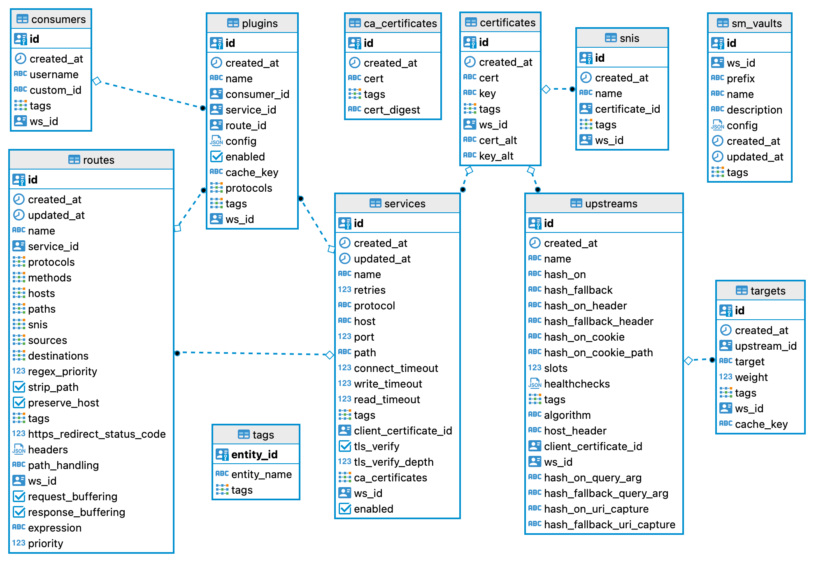

# Kong Admin APIのオブジェクトごとの整理
Kong Gateway(OSS)の設定情報は、下のER図に表現されるオブジェクトごとに定義されたテーブルに保存されます。

* PostgreSQL上に生成されたkongデータベースから[DBeaver](https://dbeaver.io/)を使って該当テーブルをピックアップしER図化しました
* テーブル定義は[Kongのマイグレーション用LUAファイル](https://github.com/Kong/kong/blob/master/kong/db/migrations/core/000_base.lua)に見ることができます

一方、Kong Admin APIは、このテーブルをうまくCRUD操作するようAPI化されており、それらはオブジェクトごとにまとめることができるので、以下にオブジェクトごとのKong Admin APIのメソッドとパス、公式ドキュメントへのリンクを表であらわします。

## Serviceオブジェクト

|operationId|Method|Path|
|:-:|:-:|:-:|
|[1-1_list-all-services](https://docs.konghq.com/gateway/3.0.x/admin-api/#list-all-services)|GET|/services|
|[1-2_create-service](https://docs.konghq.com/gateway/3.0.x/admin-api/#create-service)|POST|/services|
|[1-3_retrieve-service](https://docs.konghq.com/gateway/3.0.x/admin-api/#retrieve-service-1)|GET|/services/{service name or id}|
|[1-4_create-or-update-service](https://docs.konghq.com/gateway/3.0.x/admin-api/#create-or-update-service)|PUT|/services/{service name or id}|
|[1-5_update-service](https://docs.konghq.com/gateway/3.0.x/admin-api/#update-service-1)|PATCH|/services/{service name or id}|
|[1-6_delete-service](https://docs.konghq.com/gateway/3.0.x/admin-api/#delete-service-1)|DELETE|/services/{service name or id}|
|[1-7_list-services-associated-to-a-specific-certificate](https://docs.konghq.com/gateway/3.0.x/admin-api/#list-services-associated-to-a-specific-certificate)|GET|/certificates/{certificate name or id}/services|
|[1-8_create-service-associated-to-a-specific-certificate](https://docs.konghq.com/gateway/3.0.x/admin-api/#create-service-associated-to-a-specific-certificate)|POST|/certificates/{certificate name or id}/services|
|[1-9_retrieve-service-associated-to-a-specific-certificate](https://docs.konghq.com/gateway/3.0.x/admin-api/#retrieve-service-associated-to-a-specific-certificate)|GET|/certificates/{certificate id}/services/{service name or id}|
|[1-10_create-or-update-service-associated-to-a-specific-certificate](https://docs.konghq.com/gateway/3.0.x/admin-api/#create-or-update-service-associated-to-a-specific-certificate)|PUT|/certificates/{certificate id}/services/{service name or id}|
|[1-11_update-service-associated-to-a-specific-certificate](https://docs.konghq.com/gateway/3.0.x/admin-api/#update-service-associated-to-a-specific-certificate)|PATCH|/certificates/{certificate id}/services/{service name or id}|
|[1-12_delete-service-associated-to-a-specific-certificate](https://docs.konghq.com/gateway/3.0.x/admin-api/#delete-service-associated-to-a-specific-certificate)|DELETE|/certificates/{certificate id}/services/{service name or id}|
|[1-13_update-service-associated-to-a-specific-route](https://docs.konghq.com/gateway/3.0.x/admin-api/#update-service-associated-to-a-specific-route)|GET|/routes/{route name or id}/service|
|[1-14_retrieve-service-associated-to-a-specific-route](https://docs.konghq.com/gateway/3.0.x/admin-api/#retrieve-service-associated-to-a-specific-route)|PUT|/routes/{route name or id}/service|
|[1-15_create-or-update-service-associated-to-a-specific-route](https://docs.konghq.com/gateway/latest/admin-api/#create-or-update-service-associated-to-a-specific-route)|PATCH|/routes/{route name or id}/service|
|[1-16_retrieve-service-associated-to-a-specific-plugin](https://docs.konghq.com/gateway/3.0.x/admin-api/#retrieve-service-associated-to-a-specific-plugin)|GET|/plugins/{plugin id}/service|
|[1-17_create-or-update-service-associated-to-a-specific-plugin](https://docs.konghq.com/gateway/3.0.x/admin-api/#create-or-update-service-associated-to-a-specific-plugin)|PUT|/plugins/{plugin id}/service|
|[1-18_update-service-associated-to-a-specific-plugin](https://docs.konghq.com/gateway/3.0.x/admin-api/#update-service-associated-to-a-specific-plugin)|PATCH|/plugins/{plugin id}/service|
